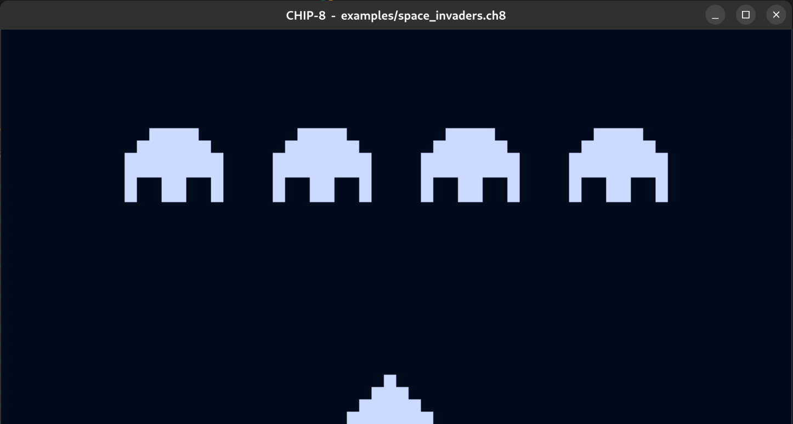
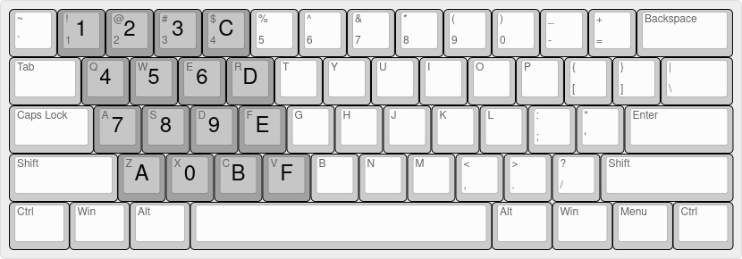

# CHIP-8 Interpreter

A basic CHIP-8 interpreter written in rust. Mostly shooting for compatibility with the original COSMAC VIP interpreter.

_Written using help from Tobias Langhoff's [Guide to making a CHIP-8 emulator ](https://tobiasvl.github.io/blog/write-a-chip-8-emulator/) and the Wikipedia [CHIP-8 article](https://en.wikipedia.org/wiki/CHIP-8)._



## Usage

`$ chip8 [OPTIONS] <ROM>`

#### Arguments

-   `<ROM>`: path of binary file (ROM) to execute

#### Options

-   `--ips <IPS>`: Set the target instructions per second (default: 700)
-   `-d, --debug`: Print debug information
-   `-h, --help`: Print help
-   `-V, --version`: Print version

### Keyboard Input

The COSMAC VIP has a keyboard with the following layout:

|     |     |     |     |
| :-: | :-: | :-: | :-: |
|  1  |  2  |  3  |  C  |
|  4  |  5  |  6  |  D  |
|  7  |  8  |  9  |  E  |
|  A  |  0  |  B  |  F  |

Typically games will use 4, 6, 2, and 8 as left, right, up, and down respectively (although some may refer to the keys mapped on a modern keyboard). Because I am targeting the COSMAC VIP, I emulated the physical layout of the buttons, hence I went with the layout shown in the diagram below:



## Assembler

For ease of writing test programs, I slapped together an extremely basic assembler that takes a file of whitespace separated, hex encoded CHIP-8 code and writes it into a .ch8 binary file, ready to be loaded. The assembler will also ignore all lines starting with a '#', allowing for commented code.

### Usage

`$ assembler.py [-h] [-o output] input`

Output will default to `out.ch8` if no file is specified

### Example source

The following is an example program that gets input from the keypad, draws the key to the screen, then beeps.

```
# get key press
F00A

# draw key
00E0
F029
6101 6201

# beep
631E F318
```

## Included ROMS

There are some example roms in the `/examples/` directory to test and play around with.

-   `buzzer_test.ch8` Toggles the buzzer on and off every seconds, used for testing the sound timer.

-   `clock.ch8` Shows the time in 24-hour format. Use the keypad to input the current time to start the clock. For example, for 1:54:30 pm, you'd input 1-3-5-4-3-0.

-   `connect4.ch8` Classic connect four game. 4 and 6 to select column, 5 to drop. Cred. David Winter, source: <https://github.com/kripod/chip8-roms/blob/master/games/Connect%204%20%5BDavid%20Winter%5D.ch8>

-   `ibm.ch8` Simply displays the IBM logo. Source: <https://github.com/loktar00/chip8/blob/master/roms/IBM%20Logo.ch8>

-   `keypad_test.ch8` Prints the last pressed key onto the screen. Used for testing instruction FX0A

-   `keypad_test2.ch8` Plays the buzzer when the key '0' is pressed. Used for testing instruction EX9E/EXA1

-   `random_loop.ch8` Prints a new random 2 byte number (0-255) to the screen once every second.

-   `random_test.ch8` Simply prints a random 2 byte number (0-255) to the screen.

-   `snake.ch8` Classic snake game. Source: <https://johnearnest.github.io/chip8Archive/>

-   `soccer.ch8` 2 player game, just like pong except each player controls 2 paddles on different columns, similar too foosball. Player 1 uses 1 and 4, player 2 uses C and D. Source: <https://johnearnest.github.io/chip8Archive/>

-   `space_invaders.ch8` Classic space invaders game, 4 and 6 to move left and right 5 to shoot. 5 to start game. Cred. David Winter, source: <https://github.com/kripod/chip8-roms/blob/master/games/Space%20Invaders%20%5BDavid%20Winter%5D.ch8>

-   `test_opcode.ch8` Checks functionality of different opcodes. Source: <https://github.com/corax89/chip8-test-rom>
